# 🔍 AI-Powered Resume Screening & Job Recommendation System

<p align="center">

### 🚀 ML Bubble 2026 — Machine Learning Awareness & Skill Building Challenge

**From Resume → Intelligence → Shortlist → Interview → Offer**

</p>

<p align="center">


</p>

---

## 🌟 Project Overview

**AI-Powered Resume Screening & Job Recommendation System** is an intelligent Machine Learning application that uses **Natural Language Processing (NLP)** and **Supervised Learning** to analyze resumes and identify the most relevant job domain for a candidate.

Instead of manually reviewing thousands of resumes, the system processes resume text, extracts meaningful linguistic features using **TF-IDF**, and uses a **Logistic Regression classifier** to predict the candidate's most suitable career category.

> **Resume in. Intelligence out.**

The project demonstrates how Machine Learning can transform a traditionally manual recruitment workflow into a faster, data-driven screening process.

---

# 🎯 Problem Statement

Recruiters can receive hundreds or even thousands of applications for a single position.

Traditional resume screening can be:

* ⏳ Time-consuming
* 🔁 Repetitive
* ⚠️ Inconsistent
* 👤 Dependent on manual judgment
* 📄 Difficult to scale

### Our Solution

The system automates the initial screening stage by:

```text
Resume
   ↓
Text Processing
   ↓
NLP Preprocessing
   ↓
TF-IDF Feature Extraction
   ↓
Machine Learning Model
   ↓
Job Category Prediction
   ↓
Recruiter Shortlisting
```

This allows recruiters to spend more time on **candidate evaluation and decision-making** rather than repetitive initial screening.

---

# 💡 Key Objectives

### 🤖 Intelligent Screening

Automatically analyze resume content and identify the most relevant job category.

### 🧠 NLP-Based Understanding

Convert unstructured resume text into meaningful numerical features.

### 📊 Machine Learning Prediction

Use supervised learning to classify resumes into career domains.

### ⚡ Faster Recruitment

Reduce the time required for initial resume screening.

### 📈 Data-Driven Recruitment

Provide consistent model-based predictions that can assist recruiters.

### 🌐 Interactive Application

Provide an easy-to-use Streamlit interface for testing resumes.

---

# 🏗️ Hiring Process — From Application to Offer

The system is designed around the modern recruitment journey:

```mermaid
flowchart LR
    A["📄 Candidate<br/>Application"] --> B["🔍 AI Resume<br/>Screening"]
    B --> C["🧠 NLP + ML<br/>Analysis"]
    C --> D["🎯 Job Category<br/>Prediction"]
    D --> E["📊 Candidate<br/>Shortlisting"]
    E --> F["💬 Interview<br/>Process"]
    F --> G["✅ Selection"]
    G --> H["🎉 Offer Letter"]

    style A fill:#4285F4,color:#fff
    style B fill:#EA4335,color:#fff
    style C fill:#FBBC05,color:#000
    style D fill:#34A853,color:#fff
    style E fill:#4285F4,color:#fff
    style F fill:#EA4335,color:#fff
    style G fill:#34A853,color:#fff
    style H fill:#FBBC05,color:#000
```



### 🔄 Recruitment Intelligence Pipeline

| Stage          | Traditional Process | AI-Assisted Process               |
| -------------- | ------------------- | --------------------------------- |
| Application    | Resume received     | Resume received                   |
| Screening      | Manual review       | 🤖 Automated NLP analysis         |
| Categorization | Recruiter judgment  | 🎯 ML prediction                  |
| Shortlisting   | Manual filtering    | 📊 Data-assisted screening        |
| Interview      | Scheduled manually  | 👥 Recruiter-led                  |
| Selection      | Human decision      | Human + AI assistance             |
| Offer          | Manual process      | 🎉 Final candidate receives offer |

> **Important:** The system is designed as a **decision-support tool**, not as a replacement for human hiring decisions.

---

# 🧠 How the AI Works

The project follows a complete Machine Learning pipeline.

```text
                    ┌─────────────────────┐
                    │   Resume Dataset    │
                    └──────────┬──────────┘
                               ↓
                    ┌─────────────────────┐
                    │  Text Cleaning      │
                    │  & Preprocessing    │
                    └──────────┬──────────┘
                               ↓
                    ┌─────────────────────┐
                    │ Stopword Removal    │
                    │ Token Processing    │
                    └──────────┬──────────┘
                               ↓
                    ┌─────────────────────┐
                    │ TF-IDF Vectorizer   │
                    └──────────┬──────────┘
                               ↓
                    ┌─────────────────────┐
                    │ Logistic Regression │
                    │     Classifier      │
                    └──────────┬──────────┘
                               ↓
                    ┌─────────────────────┐
                    │ Job Category        │
                    │ Prediction          │
                    └─────────────────────┘
```

---

# ⚙️ Machine Learning Pipeline

### 1️⃣ Dataset Loading

The resume dataset is loaded using Pandas and prepared for machine learning.

### 2️⃣ Text Cleaning

Resume text is normalized by removing unnecessary characters and formatting noise.

### 3️⃣ NLP Preprocessing

The text undergoes preprocessing including:

* Lowercasing
* Tokenization
* Stopword removal
* Text normalization

### 4️⃣ Feature Extraction

**TF-IDF — Term Frequency-Inverse Document Frequency** converts resume text into numerical feature vectors.

This helps the model identify terms that are particularly relevant to specific career categories.

### 5️⃣ Model Training

A **Logistic Regression** classifier is trained using the extracted TF-IDF features.

### 6️⃣ Evaluation

The trained model is evaluated using:

* Accuracy
* Precision
* Recall
* F1-Score
* Confusion Matrix

### 7️⃣ Model Serialization

The trained model and vectorizer are stored using **Joblib**.

### 8️⃣ Prediction

A new resume can be entered into the Streamlit application and classified automatically.

---

# 🧩 Technology Stack

| Technology      | Purpose                     |
| --------------- | --------------------------- |
| 🐍 Python       | Core programming language   |
| 🐼 Pandas       | Data processing             |
| 🔢 NumPy        | Numerical computation       |
| 🧠 Scikit-learn | Machine Learning            |
| 📝 NLTK         | Natural Language Processing |
| 📊 Matplotlib   | Data visualization          |
| 📈 Seaborn      | Statistical visualization   |
| 💾 Joblib       | Model serialization         |
| 🌐 Streamlit    | Interactive web application |
| 🔧 Git          | Version control             |
| 🐙 GitHub       | Source code & collaboration |

---

# 📚 Dataset

The project uses the publicly available **Resume Dataset** from Kaggle.

### Dataset Source

**Resume Dataset — Kaggle**

https://www.kaggle.com/datasets/snehaanbhawal/resume-dataset

The dataset contains resumes categorized into multiple professional domains and is used for supervised resume classification.

### Example Categories

* 🧠 Data Science
* 👥 Human Resources
* ☕ Java Developer
* 🧪 Testing
* ⚙️ DevOps
* 🐍 Python Developer
* 📊 Business Analyst
* 🌐 Web Designing
* ⚙️ Mechanical Engineer
* ⚡ Electrical Engineer

> Dataset availability and category distribution may vary depending on the version downloaded from Kaggle.

---

# 🤖 Machine Learning Model

## Algorithm: Logistic Regression

Logistic Regression is used as the primary classification algorithm because it is:

* Fast to train
* Computationally efficient
* Well suited for high-dimensional text features
* Interpretable compared with many complex models
* Effective as a strong baseline for NLP classification

### Feature Extraction: TF-IDF

TF-IDF assigns numerical importance to words based on their frequency within documents and their relative rarity across the dataset.

```text
Resume Text
     ↓
Tokenization
     ↓
TF-IDF
     ↓
Numerical Feature Matrix
     ↓
Logistic Regression
     ↓
Predicted Job Category
```

---

# 📊 Model Evaluation

The system evaluates classification performance using multiple metrics.

### Accuracy

Measures the overall percentage of correctly classified resumes.

### Precision

Measures how many predicted samples for a class were actually correct.

### Recall

Measures how many actual samples of a class were correctly identified.

### F1-Score

Provides a balance between precision and recall.

### Confusion Matrix

Visualizes correct and incorrect predictions across different resume categories.

---

# 📁 Project Structure

```text
ML_Bubble_2026/
│
├── 📄 app.py
├── 📄 train.py
├── 📄 predict.py
├── 📄 preprocess.py
├── 📄 evaluate.py
├── 📄 download_nltk.py
├── 📄 requirements.txt
├── 📄 README.md
│
├── 📂 dataset/
│   └── resume_dataset.csv
│
├── 📂 model/
│   ├── model.joblib
│   └── vectorizer.joblib
│
├── 📂 results/
│   ├── classification_report.txt
│   ├── confusion_matrix.png
│   └── metrics.json
│
├── 📂 report/
│   └── project_report.pdf
│
├── 📂 presentation/
│   └── ML_Bubble_2026.pptx
│
└── 📂 assets/
    ├── home.png
    ├── prediction.png
    ├── confusion_matrix.png
    └── hiring-process.gif
```

---

# 🚀 Getting Started

## 1. Clone the Repository

```bash
git clone https://github.com/yourusername/ML_Bubble_2026.git
```

## 2. Navigate to the Project

```bash
cd ML_Bubble_2026
```

## 3. Create a Virtual Environment

### Windows

```bash
python -m venv venv
venv\Scripts\activate
```

### macOS / Linux

```bash
python3 -m venv venv
source venv/bin/activate
```

## 4. Install Dependencies

```bash
pip install -r requirements.txt
```

## 5. Download NLTK Resources

```bash
python download_nltk.py
```

## 6. Train the Model

```bash
python train.py
```

## 7. Evaluate the Model

```bash
python evaluate.py
```

## 8. Launch the Application

```bash
streamlit run app.py
```

The application will then open in your browser.

---

# 🖥️ Application Workflow

```text
┌───────────────────────────────┐
│        Upload / Enter Resume  │
└───────────────┬───────────────┘
                ↓
┌───────────────────────────────┐
│       Preprocess Resume       │
└───────────────┬───────────────┘
                ↓
┌───────────────────────────────┐
│       Generate TF-IDF         │
│          Features             │
└───────────────┬───────────────┘
                ↓
┌───────────────────────────────┐
│      Logistic Regression      │
└───────────────┬───────────────┘
                ↓
┌───────────────────────────────┐
│      Predicted Job Role       │
└───────────────────────────────┘
```

---

# 🎨 Google-Inspired UI Concept

The interface follows a clean, modern design inspired by Google's product design philosophy:

### 🔵 Blue

Primary interaction and navigation

### 🔴 Red

Important alerts and highlights

### 🟡 Yellow

Insights and supporting information

### 🟢 Green

Successful predictions and positive outcomes

The visual approach focuses on:

* Minimalism
* Clear hierarchy
* Fast interaction
* Readable data
* Recruiter-friendly dashboards

> **Note:** This is a Google-inspired design direction and is **not affiliated with or endorsed by Google**.

---

# 📸 Screenshots

Add application screenshots here:

### 🏠 Home Page

```text
assets/home.png
```

### 📄 Resume Input

```text
assets/resume-input.png
```

### 🎯 Prediction Result

```text
assets/prediction.png
```

### 📊 Confusion Matrix

```text
assets/confusion_matrix.png
```

### 📋 Classification Report

```text
assets/classification-report.png
```

### 🔄 Hiring Process Animation

```text
assets/hiring-process.gif
```

---

# 📈 Results

Model evaluation outputs are automatically stored in the `results/` directory.

Example:

```text
results/
│
├── classification_report.txt
├── confusion_matrix.png
└── metrics.json
```

### Example Evaluation Dashboard

| Metric    |                   Result |
| --------- | -----------------------: |
| Accuracy  | Generated after training |
| Precision | Generated after training |
| Recall    | Generated after training |
| F1-Score  | Generated after training |

> **Do not hard-code performance numbers.** The final README should display the actual metrics produced by your trained model.

---

# 🔐 Responsible AI & Hiring

Because recruitment is a high-impact application area, this system should be treated as an **AI-assisted screening tool** rather than an autonomous hiring decision-maker.

Potential risks include:

* Dataset bias
* Historical hiring bias
* Unequal representation across categories
* False positives
* False negatives
* Over-reliance on automated predictions

### Responsible Deployment Principles

✅ Keep a human recruiter involved in final decisions.

✅ Evaluate model performance across categories.

✅ Monitor false positives and false negatives.

✅ Avoid using sensitive personal attributes as decision variables.

✅ Clearly communicate that model predictions are recommendations.

---

# 🔮 Future Improvements

The current system provides a strong NLP classification foundation. Future versions can evolve into a complete AI recruitment intelligence platform.

### 📄 1. PDF & DOCX Resume Upload

Automatically extract text from:

* PDF
* DOCX
* TXT

---

### 🎯 2. Job Description Matching

Compare resumes directly against a specific job description.

```text
Resume
   +
Job Description
   ↓
Semantic Matching
   ↓
Compatibility Score
   ↓
Recommended Candidate
```

---

### 🧠 3. Skill Extraction

Use Named Entity Recognition and NLP techniques to identify:

* Programming languages
* Frameworks
* Tools
* Certifications
* Education
* Experience
* Domain skills

---

### 🤖 4. Transformer Models

Future versions can experiment with:

* BERT
* RoBERTa
* Sentence Transformers

This can improve semantic understanding beyond traditional TF-IDF features.

---

### 📊 5. Candidate Ranking

Instead of only predicting a category, the system could rank candidates based on their relevance to a specific job.

```text
Candidate A → 94%
Candidate B → 89%
Candidate C → 84%
Candidate D → 78%
```

---

### 🔎 6. Explainable AI

Show recruiters **why** a candidate was classified into a particular category.

Example:

```text
Predicted Role:
Data Scientist

Important Resume Signals:
✓ Python
✓ Machine Learning
✓ Pandas
✓ SQL
✓ Data Analysis
```

---

### ☁️ 7. Cloud Deployment

Possible deployment platforms include:

* Streamlit Community Cloud
* Render
* AWS
* Azure
* Google Cloud

---

# 🗺️ Product Roadmap

```text
PHASE 1
Resume Classification
       ↓
PHASE 2
Resume + Job Matching
       ↓
PHASE 3
Skill Extraction
       ↓
PHASE 4
Candidate Ranking
       ↓
PHASE 5
Explainable AI
       ↓
PHASE 6
AI Recruitment Assistant
```

### Final Vision

> **An end-to-end AI recruitment assistant that helps recruiters move from thousands of applications to intelligent, explainable candidate shortlists.**

---

# 💼 Why This Project Matters

This project demonstrates practical implementation of several important Machine Learning concepts:

```text
Real-World Problem
       +
NLP
       +
Feature Engineering
       +
Supervised Learning
       +
Model Evaluation
       +
Deployment
       =
Production-Oriented ML Project
```

It combines **Machine Learning, NLP, data processing, model evaluation, visualization, and web deployment** into one end-to-end application.

---

# 🏆 ML Bubble 2026

### Machine Learning Awareness & Skill Building Challenge

This project was developed as part of:

**ML Bubble 2026**

The project focuses on applying Machine Learning concepts to a real-world recruitment problem while demonstrating the complete ML lifecycle:

```text
Data → Preprocessing → Features → Training → Evaluation → Deployment
```

---

# 👨‍💻 Author

## ML_Nerds

**Department of Computer Science**

### ML Bubble 2026 Submission

---

# 📜 License

This project is intended for **academic and educational purposes**.

The dataset is subject to the terms and conditions of its original source.

---

# ⭐ If You Like This Project

If you find this project useful or interesting:

⭐ Star the repository
🍴 Fork the project
🐛 Report issues
💡 Suggest improvements
🤝 Contribute

---

<p align="center">

### 🚀 Turning Resumes into Recruitment Intelligence

**Resume → NLP → Machine Learning → Recommendation → Better Hiring Decisions**

</p>
